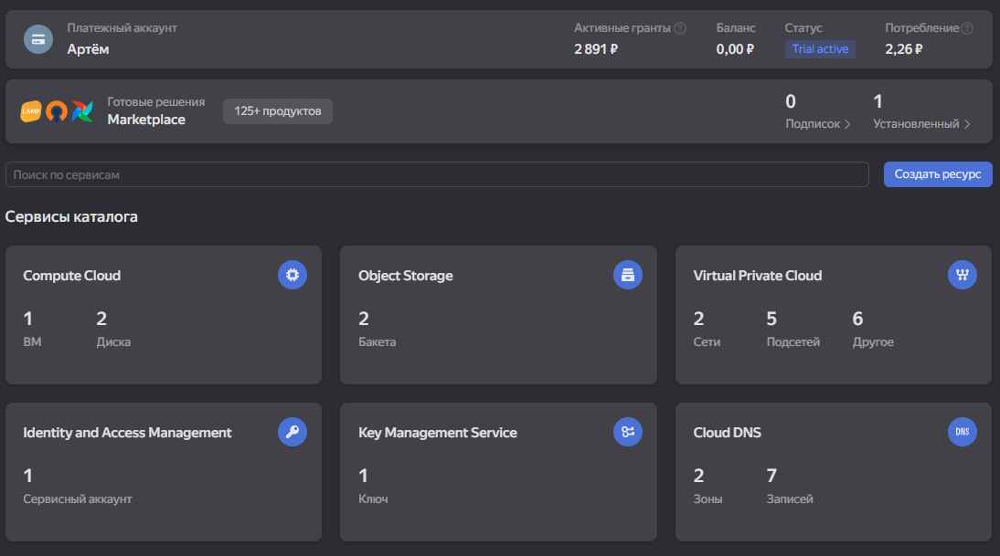

# Обоснование конфигурации

## Цель инфраструктуры

Базовая IaaS-платформа для демо-стенда "Будущее 2.0". Развертывание приложения и БД в изолированной сети с разделением публичного и приватного доступа. Подготовка к миграции сервисов данных в облако.

## Выбор ресурсов

- **App VM (2 vCPU, 4 GB RAM)**: Компромисс между стоимостью и возможностью запуска приложения. Достаточно для демо и тестирования.
- **DB VM (2 vCPU, 4 GB RAM)**: Базовые требования для PostgreSQL. Можно масштабировать при росте нагрузки.
- **Root диски (20 GB)**: Минимальный размер для Ubuntu. Достаточно для ОС и базового ПО.
- **Data диски**: 50 GB для App (логи, кэш), 100 GB для DB (данные, индексы). Network-HDD для снижения затрат.
- **Публичная подсеть**: App VM с публичным IP для доступа из интернета (SSH, HTTP).
- **Приватная подсеть**: DB VM без публичного IP. Доступ только из App VM через Security Group.

## NAT и сеть

- **Исходящий трафик из приватной подсети**: Через Egress Gateway (NAT). DB VM может обновляться и получать пакеты без входящих соединений из интернета.
- **Входящий трафик**: Только в публичную подсеть (App VM). DB доступна только из App VM по порту 5432.
- **Безопасность**: Изоляция БД в приватной подсети. Security Groups ограничивают доступ по портам и источникам.

## Почему Terraform и IaC

- **Воспроизводимость**: Одинаковая инфраструктура в dev/stage/prod. Воссоздание стенда одной командой.
- **Масштабируемость**: Легко добавлять новые VM, подсети, домены. Изменения через код, не вручную.
- **Контроль изменений**: Git history, code review, версионирование конфигурации.
- **Снижение рисков**: Нет "дрейфа конфигурации" и "снежинок". Все изменения видны в плане.

## Связь с бизнес-целями

- Быстрое и повторяемое развертывание стендов → быстрее тестируем и выводим новые фичи.
- Структурированная сеть (public/private, NAT) → повышаем безопасность медицинских и финансовых данных.
- IaC → проще масштабировать инфраструктуру под новые домены и партнеров.
- Изоляция БД в приватной подсети → соответствие требованиям регуляторов по защите данных.
- Разделение compute и storage → гибкость масштабирования и снижение затрат.

## Тестирование

Для тестирования конфигурации выполните:

```bash
# Инициализация
terraform init
terraform plan
terraform apply
terraform destroy
```

